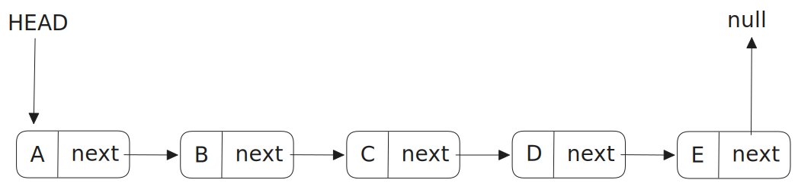
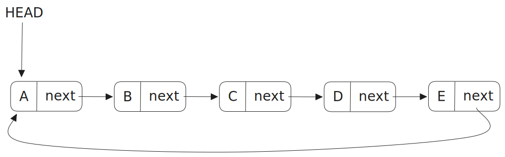
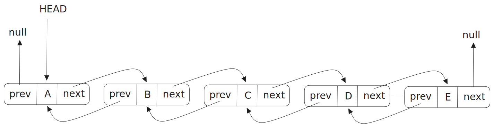
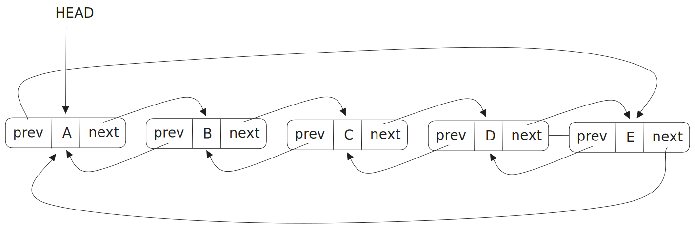

# Estrutura de Dados

## O que é Estrutura de Dados

Lorem ipsum dolor sit amet, consectetur adipiscing elit. Pellentesque et felis magna. Duis fermentum dolor bibendum, vestibulum nulla et, tristique nisi. In lacinia lobortis fermentum. Ut augue nunc, vulputate vel volutpat et, lobortis aliquet turpis. Phasellus varius nisi vel justo porttitor tincidunt. Donec consequat nisl ac dui pharetra, eu suscipit sapien rhoncus. Maecenas tincidunt tellus metus, eget semper libero lobortis eu. Donec dapibus bibendum est non vehicula.

## Para que serve uma Estrutura de Dados
Lorem ipsum dolor sit amet, consectetur adipiscing elit. Pellentesque et felis magna. Duis fermentum dolor bibendum, vestibulum nulla et, tristique nisi. In lacinia lobortis fermentum. Ut augue nunc, vulputate vel volutpat et, lobortis aliquet turpis. Phasellus varius nisi vel justo porttitor tincidunt. Donec consequat nisl ac dui pharetra, eu suscipit sapien rhoncus. Maecenas tincidunt tellus metus, eget semper libero lobortis eu. Donec dapibus bibendum est non vehicula.

## Linked List
### Os tipos de Linked List 

Basicamente exitem 4 tipos de linked list.
* Singly Linked List
* Circular Singly Linked List
* Doubly Linked List
* Circular Linked List

#### Singly Linked List

Linked list em português significa "Lista Ligada", basicamente esta Estrutura de Dados é uma lista onde cada elemento aponta para o próximo elemento.

Cada elemento de uma linked list pode ser chamado de `node`, cada `node` possuí dois atributos, um deles é o valor que queremos armazenar na lista e o outro atributo é a referência ao próximo `node` da lista.

Aqui está um exemplo de uma linked list ou mais especificamente uma singly linked list, com letras de A a E (poderia ser uma lista de compras, uma lista de livros, etc. Foi colocado letras para facilitar o exemplo). Note que temos os `nodes`, cada um tem os valores armazenados e um campo `next` que aponta para o próximo `node`. Além disso temos também um valor chamado `HEAD` que aponta para o primeiro `node` da lista. Nesse tipo de linked list o último `node` aponta para `null` pois não tem nunhum outro valor após ele.



#### Circular Singly Linked List
Este tipo de linked list é basicamente uma singly linked list só que com uma diferença, o último `node` em vez de apontar para `null`, ele aponta para o primeiro elemento da lista (por isso o nome "circular").



#### Doubly Linked List

Nesse tipo de linked list além de termos um campo `next` que aponta para o próximo `node`, também temos um campo `prev` que aponta para o `node` anterior. Além disso temos também o `HEAD` que aponta para o primeiro `node` da lista. O último `node` aponta para `null` como próximo elemento e o primeiro elemento aponta para `null` como elemento anterior



#### Circular Doubly Linked List
Aqui o funcionamento é como a circular singly linked list mas como estamos falando de um circular doubly linked list vai ter o campo `prev`. O primeiro elemento aponta para o último elemento da list no campo `prev`. O último elemento da lista aponta para o primeiro elemento de lista no campo `next`.



### Implementação 
Vamos começar criando uma classe chamada `Node` que contém um atributo `data` que irá receber o valor que queremos armazenar na lista e um atributo chamado `next` que será nossa referência ao próximo `node`.

``` javascript
class Node {
    next = null
    data = null

    constructor(data) {
        this.data = data 
    }
}

```
Agora vamos criar uma classe chamada `SinglyLinkedList` com um atributo `head` que irá apontar para o primeiro elemento da lista e uma função chamada `add` que irá adicionar os elemento na lista.

``` javascript
...

class SinglyLinkedList {
    head = null

    add(data) {
        /*
            Verifica se a lista está vazia,
            se sim adiciona o primeiro elemento na lista.
        */
        if (this.head === null) {
            const node = new Node(data)  
            this.head = head

            return
        } 

        /*
            Caso já tenha um ou mais elementos na lista, entra nesse while e
            percorre toda a lista até encontrar o último elemento para poder
            adicionar mais um elemento depois dele.
        */
        let current = this.head

        while(true) {
            if (current.next === null) {
                const node = new Node(data)

                current.next = node

                break
            }

            current = current.next
        }
    }

    remove(data) {
        /*
            Caso seja o primeiro elemento da lista para ser removido.
        */
        if (this.head.data === data) {
            this.head = this.head.next

            return
        }

        /*
            Caso seja algum elemento no meio ou
            no final da lista para ser removido.
        */
        let current = this.head

        while(true) {
            /*
                Caso chegue no final da lista e 
                não encontre o elemento para remover.
            */

            if (current.next === null) {
                break
            }
            
            /*
                Caso encontre o elemento, faz a 
                substituição da referência para o elemento após ele.
            */
            if (current.next.data === data) {
                current.next = current.next.next

                break
            }

            current = current.next
        }
    }
}

```

## Stack
### Introdução
Stack em português significa "pilha", imagine essa Estrutura de Dados como uma pilha de livros ou como uma pilha de pratos. O princípio desse tipo de Estrutura de Dados é o LIFO (Last In First Out/Último a entrar primeiro a sair).

Imagine que estamos lavando pratos e a medida que os pratos são lavados vamos impilhando eles, quando terminamos temos que guardalos e aqui o princípio LIFO entra, o último prato empilhado será o primeiro a sair da pilha.

### Implementação
#### Métodos comuns em Stack
* push => Adiciona um elemento da Stack.
* pop => Remove um elemento da Stack.
* isEmpty => Verifica se a Stack está vazia.
* isFull => Verifica se a Stack está cheia.
* peek => Retorna o elemento do topo da Stack sem remove-lo.

## Queue
## Hash Table
## Tree
## Graph
