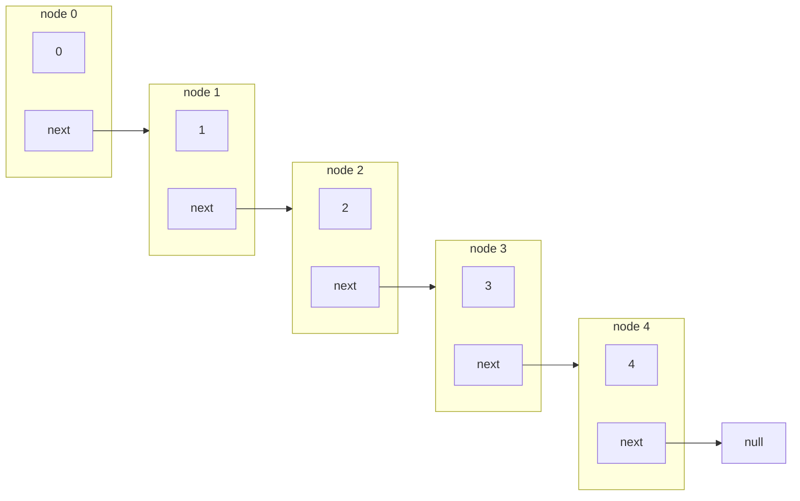
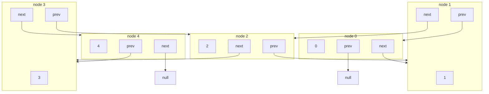

# Estrutura de Dados

## O que é Estrutura de Dados
## Para que serve uma Estrutura de Dados
## Linked List
### Introdução

Linked List em português significa "Lista Ligada", basicamente esta Estrutura de Dados é uma lista onde cada elemento aponta para o próximo elemento.

Cada elemento de uma Linked List pode ser chamado de `node`, cada `node` possuí dois atributos, um deles é o valor que queremos armazenar na lista e o outro atributo é o próximo `node`.

Aqui está um exemplo de uma Linked List ou mais especificamente um Singly Linked List, com números de 0 a 4. Note que temos os `nodes`, cada um tem os valores armazenados e o campo `next` que aponta para o próximo `node`.



### Outros tipos de Linked List
#### Doubly Linked List
Nesse tipo de Linked List além de termos um `node` apontando para o próximo, temos um campo que aponta para o `node` anterior.




#### Circular Linked List

### Implementação 
Uma Linked List começa tendo uma referência ao primeiro elemento da lista que chamamos de `HEAD`, depois disso cada elemento vai ter uma referência ao próximo elemento e assim por diante até o final da lista, o último elemento pode apontar para `null`.

Vamos começar criando uma classe chamada `Node` que contém um atributo `element` que irá receber o elemento da lista e um atributo chamado `next` que será nossa referência ao próximo elemento.

``` javascript
class Node {
    next = null
    element = null

    constructor(element) {
        this.element = element
    }
}

```
Agora vamos criar uma classe chamada `LinkedList` com um atributo `head` que irá apontar para o primeiro elemento da lista e uma função chamada `add` que irá adicionar os elemento na lista.

``` javascript
...

class LinkedList {
    head = null

    add(element) {
        if (this.head === null) {
            const node = new Node(element)  
            this.head = head

            return
        } 

        let current = this.head

        while(true) {
            if (current.next === null) {
                const node = new Node(element)

                current.next = node

                break
            }

            current = current.next
        }
    }
}

```

## Stack
### Introdução
Stack em português significa "pilha", imagine essa Estrutura de Dados como uma pilha de livros ou como uma pilha de pratos. O princípio desse tipo de Estrutura de Dados é o LIFO (Last In First Out/Último a entrar primeiro a sair).

Imagine que estamos lavando pratos e a medida que os pratos são lavados vamos impilhando eles, quando terminamos temos que guardalos e aqui o princípio LIFO entra, o último prato empilhado será o primeiro a sair da pilha.

### Implementação
#### Métodos comuns em Stack
* push => Adiciona um elemento da Stack.
* pop => Remove um elemento da Stack.
* isEmpty => Verifica se a Stack está vazia.
* isFull => Verifica se a Stack está cheia.
* peek => Retorna o elemento do topo da Stack sem remove-lo.

## Queue
## Hash Table
## Tree
## Graph
